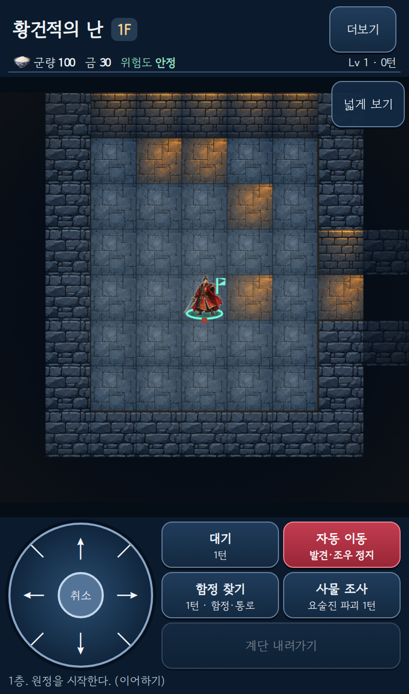

# 탐험 지도 너비 확대와 메뉴 접기

사용자 실물 모바일 피드백(2026-10-10 22:38 KST)을 반영했다. PR26, 운영 반영 전 검토 단계.

지도 높이를 제한하던 상시 HP 카드/하단 가방·부대·기록 메뉴를 제거하고 상단 더보기에 가방·부대·상태·기록·지도 안내·도움말을 모았다. 이동8방향/대기/자동 이동/수색/조사/계단은 유지한다. 필드 범례와 중복 이동 안내는 제거하고 지도 접근 안내는 스크린리더용으로 유지한다. 군량/위험/층 기믹은 상단에 남긴다. 생성기/저장/전투/배율9×9·15×15/클릭 좌표 규칙은 변경하지 않는다.

세로 화면은 앱520px 상한과 지도의 가로 여백을 제거해 캔버스를 화면 너비로 표시한다. 가로 화면은 조작부를 옆에 배치한다. 390×660 동일 검사에서 이전 지도264px→390px(+47.7%). 같은9×9에서 타일/캐릭터도 같은 비율로 확대된다. 가장 작은320px에서 버튼 설명 줄바꿈 때문에7px가 줄던 문제는 요약을 짧게 하여 해결했다.

실제 Chromium 캡처:

검증 코드 SHA a16f55635f4fc5d83d9be980c82dfbbd508e5728. [CI38056860900](https://github.com/nanpsw-eng/three-kingdoms-mystery-dungeon/actions/runs/38056860900) Domain165/build PASS. [전체 visual38056860882](https://github.com/nanpsw-eng/three-kingdoms-mystery-dungeon/actions/runs/38056860882) PASS. 증거JSON은 위 evidence에 보관한다.

- 7화면 크기/세로 지도 실제 폭=viewport 폭, 가로 제어부 표시, 긴 기믹 조건, 44px 이상 버튼/넘침 검사 PASS.
- HP/범례/메뉴줄 기본 접힘 및 모든 메뉴 접근·무료 읽기·대기/수색 턴·저장 복원 PASS.
- 8방향/실제 전투·기술/도감40/전체48캐릭터·89적/실패 자산fallback/대비/키보드/기존 승인UX 전체 회귀 PASS.
- 실물 Android와 스크린리더 조작은 NOT_RUN. 캡처는 실제 앱이며 생성 목업이 아니다.

[미리보기](https://three-kingdoms-mystery-dungeon-aku7dsdnh-nanpsw-8495.vercel.app) a16f556 READY. 운영은 이전PR25 릴리스 그대로이며 이번 후속 변경의 main 병합/운영 반영은 사용자 검토 후 진행한다. 본 문서·PNG 추가는 검증 코드와 동일 프로그램이다.
