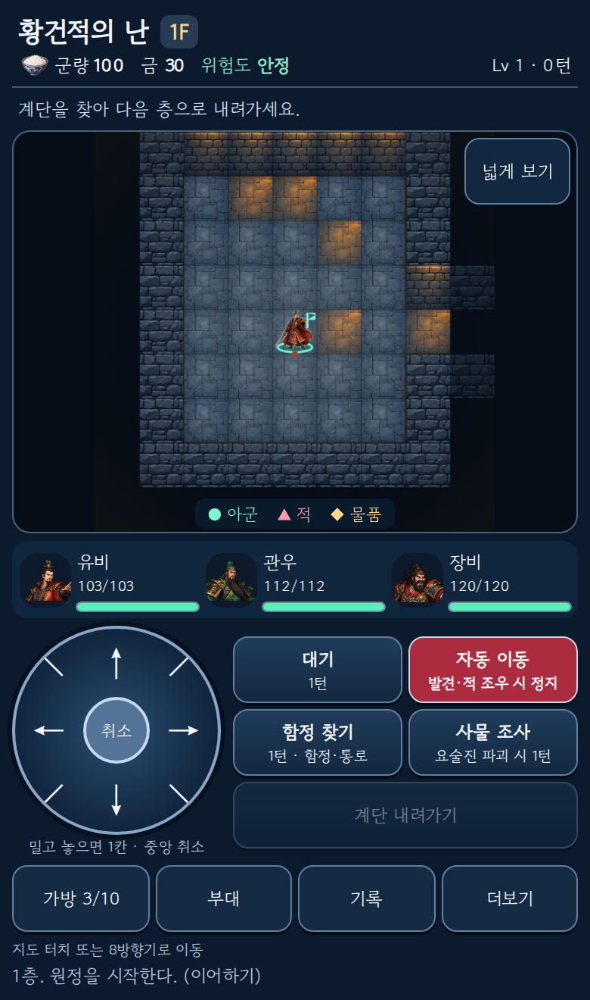
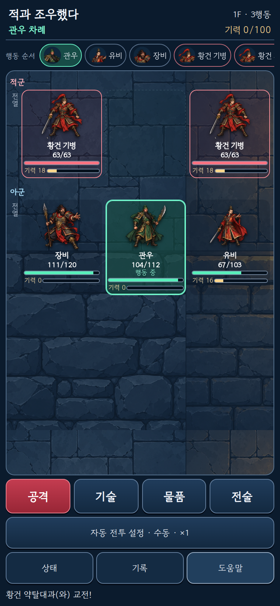

# 현대 RPG v1 구현·검증

Status: PRODUCTION RELEASED 2026-10-10. 사용자 승인 범위: 현대 2D RPG 시각·UI·조작 교체 및 방 축소 검토 이후 계속 개선. PR [#25](https://github.com/nanpsw-eng/three-kingdoms-mystery-dungeon/pull/25).

## 결과

- 지도/전투/얼굴을 같은 전신 그림으로 통일. 주요 인물7+공용 역할9, 물품/환경16, 지형4. 48개 캐릭터 고유 새 초상화를 주장하지 않는다. 이야기 삽화 및 실패 fallback 유지.
- navy/slate UI, 색·형태별 아군/적/물품 구분, 내부 스크롤 도감/가방. 전투 앞3/뒤2 유지, 대상 먼저→공격 가능, 기술 비용/효과 요약 유지.
- 8방향 패드는 release1회만 이동. 중심·바깥·pointercancel·resize·blur 무료 취소, 보조 포인터 무시, 대기 별도. 키보드 버튼 Enter가 자동 이동까지 중복 실행하던 경우 방지.
- 새 원정 방4~6×4~6, 층48×34, 기본9×9/넓게15×15. 방 안에서는 벽 둘레까지 프레이밍하고 지도 입력도 같은 원점을 사용. 기존 저장은 기존 생성기로 복원.

## 실제 화면

Actions Chromium이 실제 앱을 실행해 캡처한 화면이며 승인 시안/생성 목업이 아니다. 전투 캡처는 실제 탐험 중 조우다. 5v5 테스트는 별도 presentation adapter다.

## 검증

프로그램/자산 코드 SHA `f0a5a63a44f451ac15cd1a98d0817178a83c50ff`.

| 검사 | 결과 |
|---|---|
| Domain/기존 골든/생성 버전/저장 재생 |165/165 PASS|
| build:web, git diff-check |PASS|
| 전체 실제 Chromium suite |[visual-smoke37906721709 PASS](https://github.com/nanpsw-eng/three-kingdoms-mystery-dungeon/actions/runs/37906721709)|
| 신규 art/8방향/무료 취소/7화면 크기/키보드/저장/fallback |PASS|
| 텍스트 대비 |최소5.143779, 기준4.5 PASS|
| 실제 새 원정→탐험→전투, 이미지 누락fallback |PASS|
| 전체48장수·89종 적·화면 coverage/모바일UX |PASS|
| 탐험 가로/세로·5인·긴 조건/전투 명령·실제 기술·5v5 |PASS|
| 승인 UX 회귀/도감40 layouts/필드 art·hit 좌표 |PASS|
| 실물 터치/스크린리더/장기 플레이 체감 |NOT_RUN|

CI [push37906718602](https://github.com/nanpsw-eng/three-kingdoms-mystery-dungeon/actions/runs/37906718602) 및 [PR37906721729](https://github.com/nanpsw-eng/three-kingdoms-mystery-dungeon/actions/runs/37906721729) PASS. 보관 artifact11604568936 SHA256 c2759a240621486dac345eb88271fd4dbb3d9e540619bf38af13b9ee2058dacb. 핵심 PNG/JSON은 evidence 폴더에 지속 보관.

원격 실패에서 실제 발견한 문제를 수정했다: 벽 모서리에서 검사 이동이 막히던 문제는 도메인의 읽기 전용 접근 방향으로 검사 이동을 수정; 버튼 대비4.475→5.143; 조운 창 source 경계 누락을 cell 경계로 수정;5인+긴 조건 가로844×390 넘침을 컴팩트 부대 행으로 수정. 그 후 모든 suite PASS.

## 실제 자동 플레이 관찰

같은20개 seed/E1/유비·관우·장비/Smart 정책을 각 생성 버전에서 실행했다. 원본 JSON은 evidence/layout-play-probe.json. 모든40회가 실패/클리어로 종료했다.

| 항목 |legacy-v1|compact-v2|
|---|---:|---:|
| 클리어/실패 |1/19|0/20|
| 평균 턴 |1733.85|1506.00|
| 평균 도달 층 |11.10|9.95|
| 평균 전투 수 |38.15|33.20|

고정 편성·간단한 자동 정책의 작은 표본이다. 방 축소 후 탐험/조우 양상이 달라짐을 보여주는 관찰이며 난이도 동일성이나 개선 증거가 아니다. 전투 수치/군량은 임의 조정하지 않았다. 층40×28 및 역할별 큰 방 예외는 후속 실제 플레이 비교 후 결정한다.

## 미리보기와 운영 경계

코드 SHA와 일치하는 Vercel preview dpl_JDW4s2Ynp2WPDjBBX67tr9s2Z3uN READY: [미리보기](https://three-kingdoms-mystery-dungeon-4yjlgqml8-nanpsw-8495.vercel.app). 보호된 preview 자체의 수동 브라우저 확인은 NOT_RUN이며 실제 브라우저 증거는 같은 코드의 Actions 결과다.

운영 main88becf53409586f0bf513c34bb418d07237907f0 및 정식 도메인은 이번 개편으로 변경하지 않았다. AGENTS.md §7은 main merge/production release에 사용자 승인을 요구한다.

기존 save v1/options 누락은 legacy-v1, 새 웹 원정만compact-v2. 새 compact 저장 후 구형88becf5 전체 배포 artifact로 rollback하면 재생 호환이 깨지므로 생성 버전 지원을 보존하는 수정 릴리스로 복구한다. 세이브 삭제/일괄 변환을 사용하지 않는다. 명세와 DEC-026에 동일 계약을 기록했다.

## 2026-10-10 운영 릴리스 완료

사용자 ① 정식 배포 진행 승인. PR25 merged, 릴리스 commit `00ffd4b715c410f1fb5f3dee7a30a43aaad71317`.

- Vercel production `dpl_5vdioC3iC25sLDYUai8ULpBbHt4F` READY, [정식 주소](https://three-kingdoms-mystery-dungeon.vercel.app/) alias가 위 commit으로 연결됨.
- main [CI38054028617](https://github.com/nanpsw-eng/three-kingdoms-mystery-dungeon/actions/runs/38054028617), [visual-smoke38054028645](https://github.com/nanpsw-eng/three-kingdoms-mystery-dungeon/actions/runs/38054028645), [deploy38054028660](https://github.com/nanpsw-eng/three-kingdoms-mystery-dungeon/actions/runs/38054028660) SUCCESS. deploy는 기존 gh-pages 배포이며 Vercel은 Git integration으로 배포.
- 공개 HTTP로 HTML·실행 main.js·modern atlas3 응답 확인. 실행 코드/그림3 SHA256은 검증한 site/ 파일과 모두 일치. 증거 production-http-20261010.json.
- Vercel protected-fetch는 protection bypass API 권한403을 반환했으나 공개 HTTP는 인증 없이 정상 응답. 권한 설정 변경/인증 우회 없이 공개 경로만 확인. 운영 주소에서 실제 브라우저 조작은 NOT_RUN; 실제 Chromium 게임흐름은 동일 main 코드의 Actions suite PASS.
- 이 기록을 추가한 후속 문서 커밋은 src/web/scripts/test/workflow 변경이 없는 동일 프로그램이다. 기존 생성 버전 저장 계약/호환 복구 제한 유지. 실물 모바일 조작감·장기 난이도는 후속 사용자 플레이 피드백으로 확인한다.
